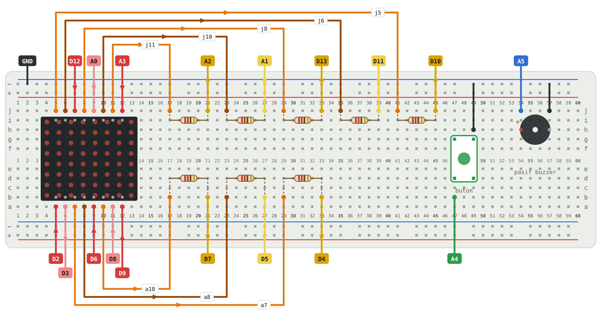

# Hafta 01 — Stacker: Kule Dikme Oyunu

**AVM'deki ödül makinesini kendin yap.** 8×8 LED matriste kayan bloğu butonla durdur, kuleyi dik, rekoru kır.

---

## Bu hafta ne öğrendik?

- 8×8 LED matrisin (1088BS) çalışma prensibi: satır ve sütun mantığı
- **Tarama** (multiplexing): 16 kabloyla 64 LED nasıl kontrol edilir
- **Ohm yasası**: Direnç neden gerekli, 220 Ω nasıl hesaplandı
- Buton okuma: `INPUT_PULLUP` ve [ark](../../SOZLUK.md) filtresi
- [EEPROM](../../SOZLUK.md): Rekor skorunu kalıcı hafızaya yazma

---

## Malzemeler

| Parça | Adet | Görevi |
|---|:---:|---|
| Arduino UNO | 1 | Beyni — kodu çalıştırır |
| Breadboard | 1 | Lehimsiz bağlantı tahtası |
| 1088BS 8×8 LED matris | 1 | Ekran — 64 kırmızı LED |
| 220 Ω direnç | 8 | LED akımını sınırlar (kırmızı-kırmızı-kahverengi) |
| Tact buton | 1 | Bloğu durdurur |
| Pasif buzzer | 1 | Ses efektleri (altında yeşil kart görünür) |
| Erkek-erkek jumper | 29 | Bağlantı kabloları |

---

## Devre

### Şema

📐 **Resimli adım adım montaj:** [Stacker_Devre_ve_Montaj.pdf](belgeler/Stacker_Devre_ve_Montaj.pdf) — montaj kartındaki yerleşimin her adımı ayrı resimde, şema, akımın yolu, kontrol listesi ve terimlerin hikâyeleriyle.

### Kablo tablosu

**Akımın yolu:** Arduino satır pini (HIGH) → kırmızı kablo → matris satırı → LED → matris sütunu → turuncu kablo → direnç → sarı kablo → Arduino sütun pini (LOW)

#### Alt sıra (a5 → a12, soldan sağa)

| Delik | Arduino pini | Kablo rengi | Not |
|:---:|:---:|:---:|---|
| a5 | D2 | 🔴 Kırmızı | Dirençsiz |
| a6 | D3 | 🔴 Kırmızı | Dirençsiz |
| a7 | D4 | 🟠 Turuncu → direnç → 🟡 Sarı | 220 Ω direnç |
| a8 | D5 | 🟠 Turuncu → direnç → 🟡 Sarı | 220 Ω direnç |
| a9 | D6 | 🔴 Kırmızı | Dirençsiz |
| a10 | D7 | 🟠 Turuncu → direnç → 🟡 Sarı | 220 Ω direnç |
| a11 | D8 | 🔴 Kırmızı | Dirençsiz |
| a12 | D9 | 🔴 Kırmızı | Dirençsiz |

#### Üst sıra (j5 → j12, soldan sağa)

| Delik | Arduino pini | Kablo rengi | Not |
|:---:|:---:|:---:|---|
| j5 | D10 | 🟠 Turuncu → direnç → 🟡 Sarı | 220 Ω direnç |
| j6 | D11 | 🟠 Turuncu → direnç → 🟡 Sarı | 220 Ω direnç |
| j7 | D12 | 🔴 Kırmızı | Dirençsiz |
| j8 | D13 | 🟠 Turuncu → direnç → 🟡 Sarı | 220 Ω direnç |
| j9 | A0 | 🔴 Kırmızı | Dirençsiz |
| j10 | A1 | 🟠 Turuncu → direnç → 🟡 Sarı | 220 Ω direnç |
| j11 | A2 | 🟠 Turuncu → direnç → 🟡 Sarı | 220 Ω direnç |
| j12 | A3 | 🔴 Kırmızı | Dirençsiz |

#### Buton ve buzzer

| Parça | Bağlantı | Arduino pini |
|---|---|:---:|
| Buton | Bir ucu A4, diğer ucu GND (− hattı) | A4 |
| Buzzer | Uzun bacak A5, kısa bacak GND (− hattı) | A5 |
| GND | Arduino GND → breadboard üst − hattı | GND |

---

## Hangi kodu yükleyeyim?

Sırayla:

### 1. Önce: Bağlantı testi
📁 [`matris_test.ino`](kod/matris_test/matris_test.ino)

8 yatay çizgi, sonra 8 dikey çizgi tek tek yanmalı. Yanmayan çizgiyi Seri Monitör'de (9600 baud) gör, o kabloyu kontrol et.

### 2. Sonra: Oyunu oyna
📁 [`stacker_ogrenci.ino`](kod/stacker_ogrenci/stacker_ogrenci.ino)

Derste kullandığımız sade sürüm. Kod 10 bölüme ayrılmış, her bölümde `#` ve `.` ile çizilmiş resimler var. Açılışta ekran 3 kez yanıp söner ve 3 bip duyulur.

### 3. Merak ediyorsan: İleri sürüm
📁 [`stacker_pro.ino`](kod/stacker_pro/stacker_pro.ino)

Aynı oyun, ama bit maskeleri, `PROGMEM` ve `__builtin_popcount` kullanılmış. Ekranı `bool[8][8]` yerine `byte[8]` ile tutuyor, RAM tasarruf ediyor. Aynı devreye doğrudan yüklenir.

### 🎵 Bonus: Müzik dene
📁 [`bonus_muzik.ino`](kod/bonus_muzik/bonus_muzik.ino)

Hiçbir kablo değiştirmeden, sadece bu kodu yükle. Butona bas: Tetris müziği çalar. Tekrar bas: Dağ Kralının Salonunda (hızlanarak). Aynı buton (A4) ve buzzer (A5) devresini kullanıyor.

---

## Sık karşılaşılan sorunlar (bu haftaya özel)

| Belirti | Muhtemel sebep | Çözüm |
|---|---|---|
| Hiçbir LED yanmıyor | Kutup ayarı ya da matris ters takılı | Matrisin yazısı sana bakıyor mu? Kodda `SATIR_ANOT`'u değiştir. |
| Bir çizgi hiç yanmıyor | Gevşek kablo ya da direnç | Seri Monitör'ün yazdığı deliğe bak, kabloyu bastır. |
| Görüntü karışık | Kablo yanlış deliğe ya da yanlış pine | Kablo tablosuyla tek tek karşılaştır. |
| Buzzer / buton çalışmıyor | GND takılmamış ya da hat ortadan bölünmüş | GND'yi buton/buzzer'ın olduğu yarıya tak. |
| Buton çalışmıyor | A4 yuvası sıkı, kablo temas etmiyor | Kabloyu bastır ya da SDA yuvasını dene. |
| Melodi cızırtılı | Aktif buzzer takılmış | Altında yeşil kart olan **pasif** buzzer'ı kullan. |
| Kule yandan büyüyor | Matrisin yönü farklı | Kodda `donusDerecesi`'ni 90, 180 ya da 270 yap. |

Genel sorunlar için → [Sorun giderme](../../SORUN-GIDERME.md)

---

## Evde dene / Görevler

### 9. sınıf

**Görev 1 — Kendi resmini çiz:** Kareli kâğıda 8×8 bir kare çiz, kendi resmini tasarla (yıldız, ok, baş harfin…). Kodda `MUTLU` dizisinin yerine `#` ve `.` ile yaz. Kaybedince senin resmin görünecek.

**Soru 1:** Bir satırda aynı anda 3 LED yanarken pinden yaklaşık kaç mA geçer? Neden 4 değil de 3? *(İpucu: Ohm yasası ve 40 mA sınırı)*

**Soru 2:** Breadboard'da `a17` ile `e17` bağlı mıdır? Peki `e17` ile `f17`?

### 10. sınıf

**Görev 2 — Kendi seviyeni tasarla:** Seviye listelerinden birini değiştir: hız, genişlik, rüzgâr, hayalet parametrelerini ayarla. Başka bir grup senin seviyeni oynasın. En zor ama hâlâ geçilebilir seviyeyi kim tasarlayacak?

**Soru 3:** `donusDerecesi = -630` yazarsak kule hangi kenardan büyür? Önce kâğıtta hesapla, sonra dene. *(İpucu: −630 % 360 = ?)*

**Soru 4:** `butonaBasildi()` fonksiyonundaki 50 ms kontrolünü silersek ne olur? Neden?

**Soru 5 — Tartışma:** Son katta bloğu gizlice bir adım kaydıran bir "AVM modu" yazmak kaç satır sürer? Böyle bir makine dürüst müdür?

---

## İleri okuma

- 📄 [Stacker Ders Kitapçığı (PDF)](belgeler/Stacker_Ders_Kitapcigi.pdf) — Malzemeler, Ohm yasası, tarama, montaj, test, kod açıklaması, görevler ve sözlük. 16 sayfa.
- 📋 [Montaj kartı (Markdown)](belgeler/stacker_montaj_karti.md) — Rol kartları ve adım adım montaj talimatları.

---

← [Ana sayfa](../../README.md) · [Başlarken](../../BASLARKEN.md) · [Sorun giderme](../../SORUN-GIDERME.md) · [Sözlük](../../SOZLUK.md)
